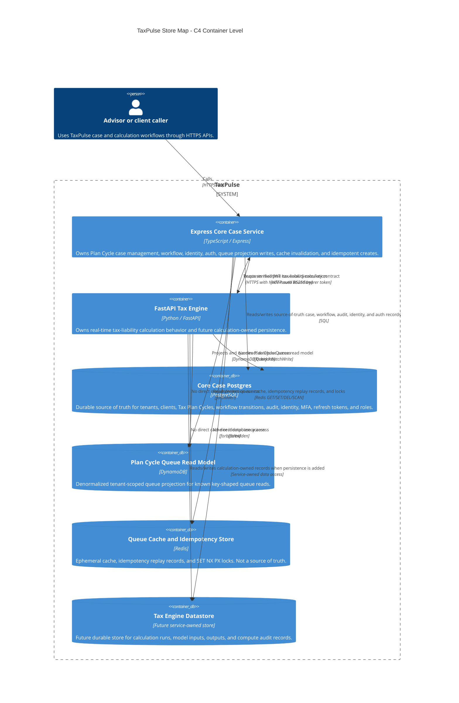

# ADR-0009 — Storage decision matrix and bounded contexts

- Status: Accepted

## Context

Week 4 Day 1 added Postgres, DynamoDB Local, and Redis to TaxPulse. The new risk is unclear ownership: future features could place audited case records in DynamoDB, treat Redis as a durable record, or use DynamoDB as an expensive cache. This ADR records the six-factor store decision matrix so each placement is defensible by access patterns, consistency, joins, scale, cost, and audit needs.

This deliverable is documentation-only. It does not change the running services, schemas, routes, or Compose stack.

## Decision

TaxPulse will place each data concern in exactly one primary store:

| TaxPulse data concern | Access patterns | Consistency expectation | Joins | Scale | Cost | Audit | Store | Bounded context owner | Rationale |
| --- | --- | --- | --- | --- | --- | --- | --- | --- | --- |
| Transactional case data | Create/read/update Tax Plan Cycles, clients, tenants, workflow transitions, audit entries, identity/auth/session records | Strong consistency for source-of-truth writes and read-your-own-write case flows | Yes: tenant, client, cycle, transition, audit, role, and auth relationships | Moderate transactional workload with indexed reads | Relational indexes and transactions fit the workload without duplicating records | Durable audit and retention requirements | PostgreSQL | Core Case Service (`apps/api`) | Joins + audit + durable retention drive this to Postgres. This includes Tax Plan Cycle records, clients/tenants, stage transitions, audit entries, credentials, MFA, refresh tokens, and roles. |
| Plan Cycle Queue read model | List queue by tenant/stage, list advisor queue by tenant/owner/stage, read projected cycle, list overdue by due date | Eventual for advisor queue display; strong/read-your-own-write only when verifying a just-refreshed projection | No joins on the read path; queue row is denormalized from Postgres | High-volume key/range read pattern | On-demand key queries avoid rebuilding relational joins for every queue refresh | Rebuildable projection, not the audit record | DynamoDB | Core Case Service (`apps/api`) | Known high-volume key/range reads + no joins make DynamoDB the right read-model store. Postgres remains the record. |
| Idempotency keys @ 24h TTL | `idem:<tenant_id>:<Idempotency-Key>` replay and `lock:<tenant_id>:<Idempotency-Key>` SET NX PX serialization for retried creates | Short-lived replay consistency; lock must outlive the handler; replay expires after 24h | No joins | Bursty under retries and concurrent creates | Redis key operations are cheap and fast for short-lived metadata | No durable audit record; outcome remains in Postgres | Redis | Core Case Service (`apps/api`) | TTL + SET NX PX + no join/audit record drive this to Redis. The key protects a Postgres create; it is not the Tax Plan Cycle record. |
| Cached queue read | Hot queue read by tenant/stage/owner/limit with cache-aside, TTL, invalidation, and stampede guard | Bounded staleness with explicit TTL and invalidation after create/transition | No joins; cache stores read-model response only | Very high repeated advisor refreshes | Redis avoids repeated paid DynamoDB reads for the same hot queue key | Ephemeral and rebuildable from DynamoDB/Postgres | Redis | Core Case Service (`apps/api`) | Hot reads + rebuildability drive this to Redis. Redis is only an accelerator; cache loss must not lose a case or queue projection. |

### Bounded context ownership

The Core Case Service owns the Core Case PostgreSQL records, the DynamoDB Plan Cycle Queue projection, and the Redis cache/idempotency keys because those stores serve case, workflow, identity, and queue behavior. The FastAPI Tax Engine owns only calculation behavior and future calculation-owned persistence. It has no direct access to Core Case Postgres, DynamoDB, or Redis; cross-context access stays behind service APIs.

### Supporting artifacts

- [store-map.mmd](store-map.mmd) contains the C4 container-level store map.
- [cost-estimate.md](cost-estimate.md) contains the 1x/10x/100x DynamoDB read-cost table.

### C4 container-level store map

### Read cost estimate (1x / 10x / 100x)

| Load | Reads / month | DynamoDB reads after cache | RRU math | Estimated read cost |
| --- | ---: | ---: | ---: | ---: |
| `1x` | 10,000,000 | 10,000,000 | 10,000,000 x 0.5 = 5,000,000 RRUs | $0.63 |
| `10x` | 100,000,000 | 100,000,000 | 100,000,000 x 0.5 = 50,000,000 RRUs | $6.25 |
| `100x` | 1,000,000,000 | 1,000,000,000 | 1,000,000,000 x 0.5 = 500,000,000 RRUs | $62.50 |
| `100x + 90% Redis hit` | 1,000,000,000 | 100,000,000 | 100,000,000 x 0.5 = 50,000,000 RRUs | $6.25 |

*Note: Pricing uses $0.125 per 1,000,000 RRUs (AWS DynamoDB US East on-demand pricing sample, flagged for confirmation prior to production budgeting). Each eventually consistent read ≤4 KB consumes 0.5 RRU. At 100x, Redis cache-aside absorbs 90% of traffic, reducing paid DynamoDB reads to 100M/month (~10x cheaper).*

## Consequences

- Audited, joined, transactional Core Case data defaults to PostgreSQL.
- DynamoDB is a read model for the Plan Cycle Queue access pattern, not a replacement source of truth and not a cache.
- Redis may cache and serialize, but every Redis value must be temporary, rebuildable, or safely expirable.
- Future Tax Engine persistence must be owned by the Tax Engine bounded context and must not create a shared database boundary with the Core Case Service.

## Alternatives considered & polyglot anti-patterns

- **Put transactional case data in DynamoDB**: Rejected because the case domain needs joins, strong transactional writes, durable audit trails, and relational constraints. Primary store remains PostgreSQL.
- **NoSQL-as-cache anti-pattern (using DynamoDB as an ephemeral cache)**: Rejected; using DynamoDB for high-frequency ephemeral hot queue reads is expensive and anti-pattern. **Fix**: Place Redis cache-aside in front of DynamoDB for hot ephemeral queue reads; data routes back to DynamoDB (queue read model) and PostgreSQL (source of truth).
- **Store queue cache or idempotency records as durable Postgres rows**: Rejected because these are short-lived operational keys where Redis TTL and SET NX PX behavior match the access pattern.
- **Cache-as-source-of-truth anti-pattern (storing primary data only in Redis)**: Rejected; Redis data loss must never lose TaxPulse business records. **Fix**: Treat Redis entries as strictly ephemeral/rebuildable or 24h-expirable; all authoritative business state routes back to PostgreSQL (and its DynamoDB read-model projection).
