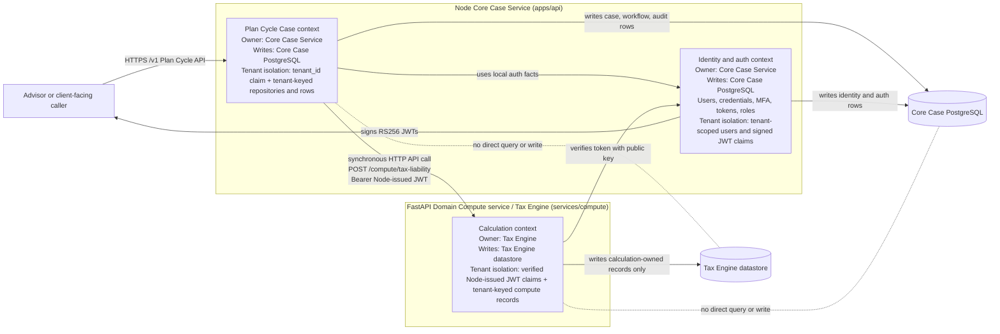

# TaxPulse Service Boundaries

TaxPulse uses two coherent bounded contexts for the current product shape. The split is by business capability, not by table: the Node Core Case Service owns case management and identity, while the FastAPI Tax Engine owns calculation behavior.

## Ownership

The Node Core Case Service (`apps/api`) owns the Plan Cycle Case context and the identity and auth context. It writes to the Core Case PostgreSQL datastore, including Tax Plan Cycle case records, stage transitions, audit records, users, credentials, MFA enrollment state, refresh-token records, roles, and tenant-scoped authorization facts. Tenant isolation is enforced by tenant-scoped JWT claims, route guards, repository methods that require `tenant_id`, and database rows keyed by tenant.

The FastAPI Domain Compute service / Tax Engine (`services/compute`) owns tax-liability calculations. It writes only to its own Tax Engine datastore when calculation-owned persistence is needed, such as calculation runs, model inputs, derived outputs, or compute audit records. It does not write Plan Cycle Case, identity, auth, or role data. Tenant isolation is enforced by verifying Node-issued RS256 JWTs with the Tax Engine's public key, deriving tenant context from verified claims, and storing any Tax Engine-owned records with tenant scope in the Tax Engine datastore.

Cross-context access is always through an API. During this sprint, the Core Case Service synchronously calls the Tax Engine HTTP API for real-time tax-liability calculation. The Tax Engine verifies the Node-issued bearer token, performs the calculation, and returns the result. Neither service reads from or writes to the other service's database.

## Bounded-Context Map

## Boundary Rules

- The Core Case Service owns case state; the Tax Engine owns calculation state.
- Identity and auth are part of the Core Case Service boundary for the MVP.
- Each service writes only to its own datastore.
- Cross-boundary reads or writes must use an API owned by the target context.
- Direct cross-boundary database joins, reads, or writes are forbidden.
- A schema change in one service must be absorbed by that service's API contract or released as an explicit API contract change; it must not silently break another service through shared database coupling.
