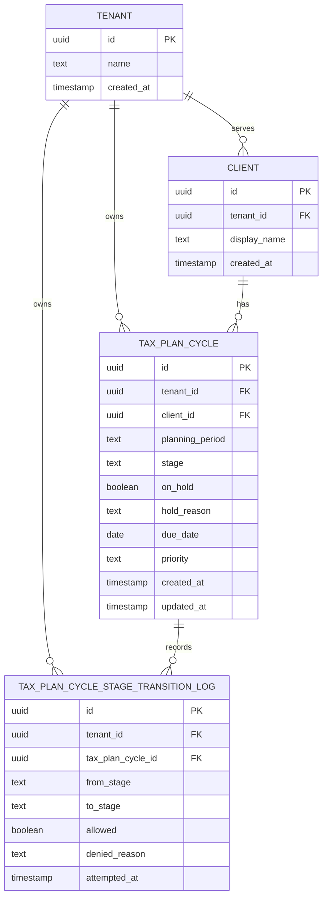

# Tax Plan Cycle -- relational data model

## Entities & relationships

This model keeps the Tax Plan Cycle lifecycle explicit with `tax_plan_cycle.stage`. Do not infer case condition from the existence of transition-log rows, approvals, action items, or other related data.

| Relationship | Cardinality | Foreign key placement | Cardinality proof |
| --- | --- | --- | --- |
| `tenant` owns `client` | One tenant to many clients | `client.tenant_id` references `tenant.id` | Fictional tenant `Evergreen Advisory` can serve fictional clients `Avery Stone` and `Morgan Reed`; each client belongs to one firm tenant. |
| `tenant` owns `tax_plan_cycle` | One tenant to many Tax Plan Cycles | `tax_plan_cycle.tenant_id` references `tenant.id` | Fictional tenant `Evergreen Advisory` can own 2026 Q1 and 2026 Q2 cycles; each cycle is isolated to one tenant. |
| `client` has `tax_plan_cycle` records | One client to many Tax Plan Cycles | `tax_plan_cycle.client_id` references `client.id` | Fictional client `Avery Stone` can have separate 2026 Q1 and 2026 Q2 planning cycles; each cycle is for one client and one planning period. |
| `tax_plan_cycle` records `tax_plan_cycle_stage_transition_log` rows | One Tax Plan Cycle to many transition-log rows | `tax_plan_cycle_stage_transition_log.tax_plan_cycle_id` references `tax_plan_cycle.id` | Fictional cycle `cycle-2026-q1-a` can log `Intake` to `Data Aggregation`, `Data Aggregation` to `Modeling`, and a denied `Modeling` to `Archived` attempt. |
| `tenant` owns `tax_plan_cycle_stage_transition_log` | One tenant to many transition-log rows | `tax_plan_cycle_stage_transition_log.tenant_id` references `tenant.id` | Fictional tenant `Evergreen Advisory` can have transition logs across many cycles; each log row also carries `tenant_id` so database policies can enforce tenant isolation. |

`tenant_id` is first-class on every case-related entity: `client`, `tax_plan_cycle`, and `tax_plan_cycle_stage_transition_log`. The transition-log table keeps its own `tenant_id` even though the tenant is reachable through `tax_plan_cycle` so row-level tenant isolation does not depend on joining through the parent cycle.

## ER diagram

## Normalization note

The model is in third normal form. Each table represents one entity, each non-key attribute describes the key of that table, and there are no repeating groups such as multiple clients, planning periods, or transition rows stored in one column. One-to-many relationships are represented with foreign keys on the many side instead of repeated columns or comma-separated lists.

There are no deliberately denormalized descriptive values in this model. The repeated `tenant_id` on case-related tables is an isolation key, not a cached tenant description; it stays in sync through foreign-key constraints and write paths that create child rows with the same tenant as the parent case context.
