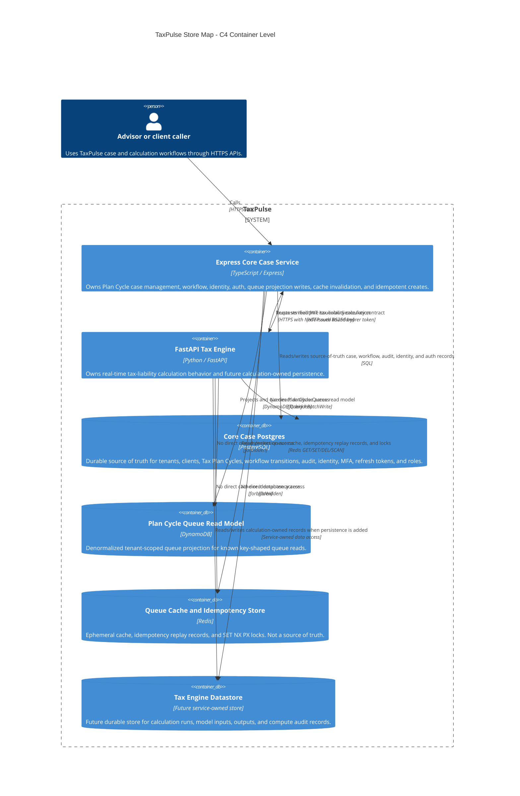

# M4D2 PR Description: The Storage Decision Matrix

## Summary

This PR establishes the architectural governance and decision matrix for TaxPulse multi-store polyglot persistence across PostgreSQL, DynamoDB, and Redis. It provides [ADR-0009](docs/adr/0009-storage-decision-matrix.md), a C4 container-level store map, a 1x/10x/100x DynamoDB read-cost estimate, anti-pattern evaluations (NoSQL-as-cache & cache-as-source-of-truth), and clear bounded-context ownership rules.

## PR Setup

- **Branch**: `m4d2-implementation`
- **Assignees**: Self-assigned (@martins-okorie)
- **Reviewers**: ES requested

---

## Verification Evidence

### 1. Storage Decision Matrix (from ADR-0009)

| TaxPulse data concern | Access patterns | Consistency expectation | Joins | Scale | Cost | Audit | Store | Bounded context owner | Rationale |
| --- | --- | --- | --- | --- | --- | --- | --- | --- | --- |
| Transactional case data | Create/read/update Tax Plan Cycles, clients, tenants, workflow transitions, audit entries, identity/auth/session records | Strong consistency for source-of-truth writes and read-your-own-write case flows | Yes: tenant, client, cycle, transition, audit, role, and auth relationships | Moderate transactional workload with indexed reads | Relational indexes and transactions fit the workload without duplicating records | Durable audit and retention requirements | PostgreSQL | Core Case Service (`apps/api`) | Joins + audit + durable retention drive this to Postgres. This includes Tax Plan Cycle records, clients/tenants, stage transitions, audit entries, credentials, MFA, refresh tokens, and roles. |
| Plan Cycle Queue read model | List queue by tenant/stage, list advisor queue by tenant/owner/stage, read projected cycle, list overdue by due date | Eventual for advisor queue display; strong/read-your-own-write only when verifying a just-refreshed projection | No joins on the read path; queue row is denormalized from Postgres | High-volume key/range read pattern | On-demand key queries avoid rebuilding relational joins for every queue refresh | Rebuildable projection, not the audit record | DynamoDB | Core Case Service (`apps/api`) | Known high-volume key/range reads + no joins make DynamoDB the right read-model store. Postgres remains the record. |
| Idempotency keys @ 24h TTL | `idem:<tenant_id>:<Idempotency-Key>` replay and `lock:<tenant_id>:<Idempotency-Key>` SET NX PX serialization for retried creates | Short-lived replay consistency; lock must outlive the handler; replay expires after 24h | No joins | Bursty under retries and concurrent creates | Redis key operations are cheap and fast for short-lived metadata | No durable audit record; outcome remains in Postgres | Redis | Core Case Service (`apps/api`) | TTL + SET NX PX + no join/audit record drive this to Redis. The key protects a Postgres create; it is not the Tax Plan Cycle record. |
| Cached queue read | Hot queue read by tenant/stage/owner/limit with cache-aside, TTL, invalidation, and stampede guard | Bounded staleness with explicit TTL and invalidation after create/transition | No joins; cache stores read-model response only | Very high repeated advisor refreshes | Redis avoids repeated paid DynamoDB reads for the same hot queue key | Ephemeral and rebuildable from DynamoDB/Postgres | Redis | Core Case Service (`apps/api`) | Hot reads + rebuildability drive this to Redis. Redis is only an accelerator; cache loss must not lose a case or queue projection. |

---

### 2. C4 Store Map (Mermaid container-level diagram)

---

### 3. DynamoDB Read Cost Math & Estimate Table

| Load | Reads / month | DynamoDB reads after cache | RRU math | Estimated read cost |
| --- | ---: | ---: | ---: | ---: |
| `1x` | 10,000,000 | 10,000,000 | 10,000,000 x 0.5 = 5,000,000 RRUs | $0.63 |
| `10x` | 100,000,000 | 100,000,000 | 100,000,000 x 0.5 = 50,000,000 RRUs | $6.25 |
| `100x` | 1,000,000,000 | 1,000,000,000 | 1,000,000,000 x 0.5 = 500,000,000 RRUs | $62.50 |
| `100x + 90% Redis hit` | 1,000,000,000 | 100,000,000 | 100,000,000 x 0.5 = 50,000,000 RRUs | $6.25 |

- **RRU Math**: Eventually consistent read at or below 4 KB = `0.5 RRU`.
- **Sample Rate Confirmation**: Priced at `$0.125 per 1,000,000 RRUs` (AWS US East pricing sample, flagged for confirmation prior to production budgeting).
- **Scale multiple needing cache**: `100x` load scale. At `100x` uncached, monthly read costs reach `$62.50`. Adding a 90% Redis hit rate absorbs 900M reads, reducing DynamoDB read cost back to `$6.25` (~10x cheaper).

---

### 4. Polyglot Anti-Patterns Evaluation

- **NoSQL-as-cache anti-pattern**: Using DynamoDB for high-frequency ephemeral hot reads. **Fix**: Place Redis cache-aside in front of DynamoDB for hot ephemeral queue reads; read model data routes back to DynamoDB and PostgreSQL.
- **Cache-as-source-of-truth anti-pattern**: Relying on Redis as a primary data store without backing persistence. **Fix**: Treat Redis entries as strictly ephemeral/rebuildable or 24h-expirable; authoritative business state routes back to PostgreSQL (and its DynamoDB projection).

---

## AI-Tool Reflection

I **accepted** Codex's suggestion to format ADR-0009 using the MADR template and to embed both the six-factor decision matrix and explicit anti-pattern resolutions in the ADR because it makes every store choice immediately auditable against architectural criteria. I **rejected** an earlier suggestion to model the FastAPI Tax Engine as sharing the PostgreSQL or Redis stores with the Core Case Service; doing so would violate bounded context boundaries and introduce anti-pattern shared-database coupling.

---

## Grading Rubric Checklist

- [x] **Decision matrix complete**: ADR-0009 scores every TaxPulse data concern across access patterns, consistency, joins, scale, cost, and audit, and places each in Postgres/DynamoDB/Redis with a per-cell justification; transactional case data is in Postgres, the queue read model is a DynamoDB candidate, and Redis is only a cache/idempotency; the ADR names the owning context and is linked from the `README.md`.
- [x] **C4 store map**: A Mermaid C4 container-level diagram shows the Express + FastAPI services and the Postgres/DynamoDB/Redis stores with labeled usage arrows, one owner per store, Redis as a cache — an architecture map, not a Docker diagram — attached to ADR-0009.
- [x] **Anti-patterns named**: The ADR records NoSQL-as-cache and cache-as-source-of-truth as considered/rejected, each with the correct fix and the store the data routes back to.
- [x] **Cost view**: A 1×/10×/100× cost table for the heaviest read shows the RRU math (0.5 RRU eventual ≤4 KB), a sample rate flagged for confirmation, and a cached-100× row ~10× cheaper, flagging the multiple that needs a cache.
- [x] **PR description**: Verification evidence pasted (the ADR’s matrix, map, and cost table, or their rendered output); AI-tool reflection paragraph names at least one accepted and one rejected suggestion.
- [x] **PR setup**: Branch is `m4d2-implementation`; PR self-assigned (Assignees); ES requested under Reviewers.
